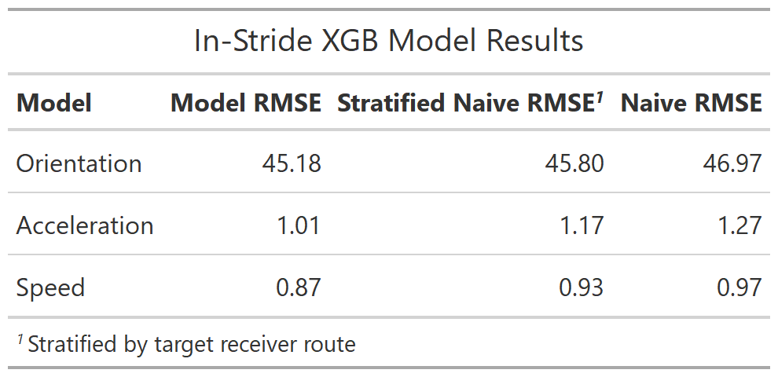
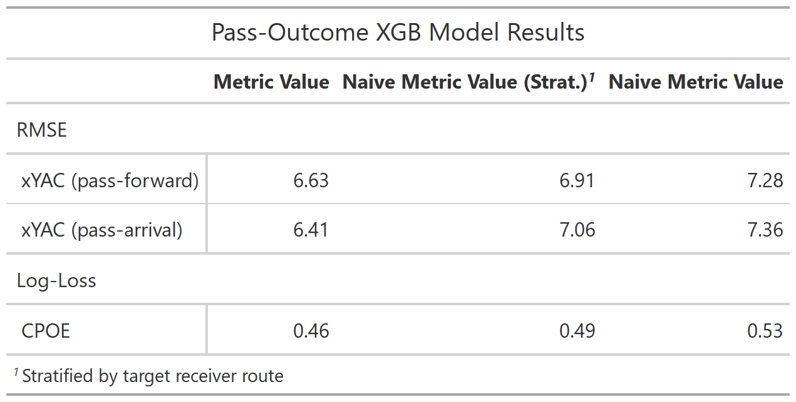
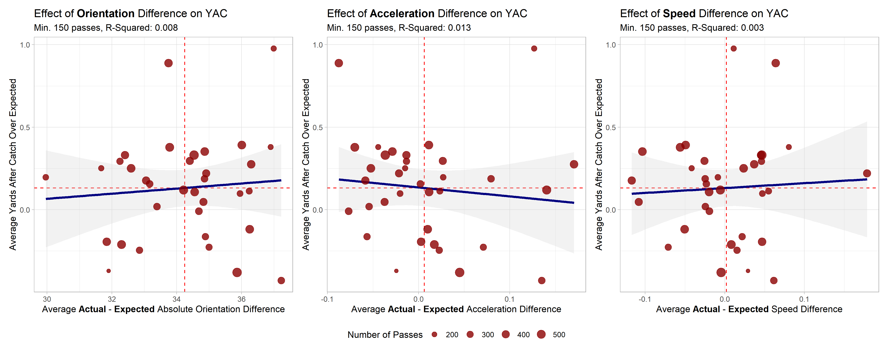
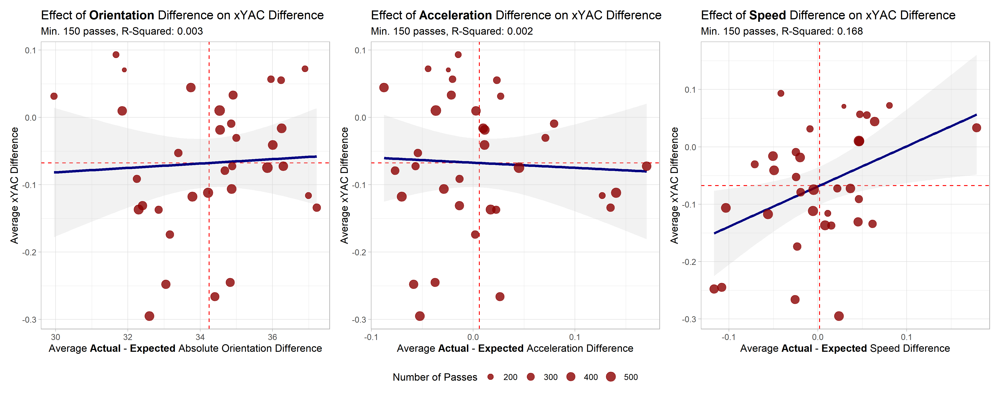
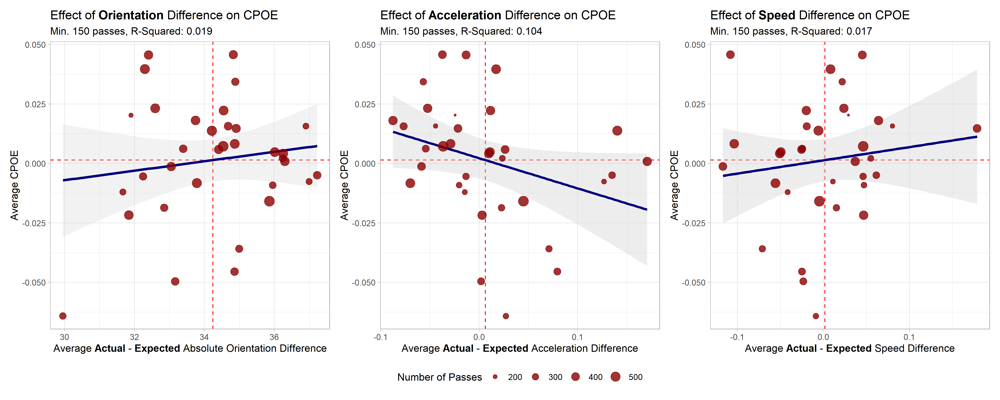
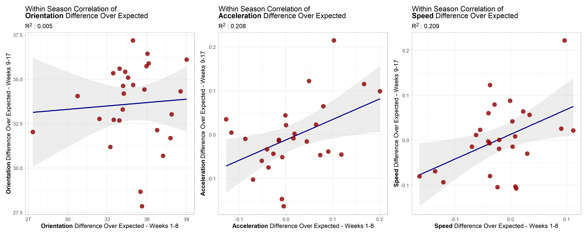
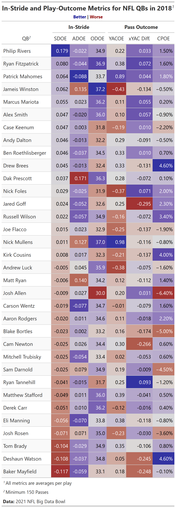

# An Analysis of Quarterback Ability to Hit Receivers In-Stride Using NFL Player Tracking Data
### Dani Treisman
---

> ## Abstract
> *This report is an investigation into the ability of NFL quarterbacks to hit receivers *in-stride*. This 'ability' is defined as the quarterback's skill in preventing extreme orientation, acceleration, and speed changes for the receiver (i.e. back-shoulder catches), from the moment of the throw to the moment the pass arrives at the receiver. This work provides a starting point for more specific methods of quarterback evaluation using frame-level player tracking data and provides evidence that quarterbacks to do have some ability to hit receivers in-stride. The main findings in this paper are: 1) the aggregated (by QB) *observed-expected* values for receiver Acceleration Difference Over Expected correlate moderately with average Completion Probability Over Expected (CPOE), 2) Average (by QB) receiver Speed Difference Over Expected and expected Yards After Catch difference from pass forward to pass arrival (xYAC Difference) are highly correlated, and 3) average Acceleration and Speed differences Over Expected are stable for QBs within-season.*

# 1. Introduction

Evaluation metrics for NFL quarterbacks are a dime a dozen, and while there are a few that have become the gold standard (EPA/play, CPOE, etc.), the quarterback position is likely the most valuable position on an American football offense, so there is a constant flow of attempts at new methods of evaluation. As sports analytics has evolved and grown into what it is today, teams in all sports have had no choice but to invest in resources and infrastructure to gain a competitive advantage through the use of analytics. In the NFL and most other sports, analytics in the most basic sense have almost always existed. However, those rudimentary statistics such as the number of touchdowns or completions have evolved into complex methodologies and formulas. These new methods of evaluation are only possible due to the large investments in data infrastructure and resources which have been further augmented by rapid advancements in player tracking technology. Until recently, player tracking data has been mostly unavailable to the public since it is often tracked by private companies and sold or distributed to teams. However, many sports leagues are giving the public access to small amounts of tracking data, which has led to advancements and increased public interest in sports analytics. The NFL does not yet give full public access to their tracking data. However, for the last few years they have hosted the Big Data Bowl, an analytics competition open to the public with the goal of advancing the field and creating an opportunity for individuals to get involved in football analytics by providing proprietary tracking data that has never before been seen by public analysts.

With these small snippets of tracking data now available, there are opportunities for more advanced analyses. For example, quarterback pass accuracy was generally measured using completion percentage, and more recently, Completion Percentage Over Expected (CPOE). However, most publicly available models for CPOE use situational variables such as *down*, *yardline*, and *time remaining.* Tracking data allows us to be more specific in our models since we have frame-by-frame data on each player's location, speed, orientation, and more. In this paper, I will use frame-level player-tracking variables from the 2021 NFL Big Data Bowl dataset (which includes data from the 2018 NFL season) to evaluate the observed - expected changes in receiver orientation, acceleration, and speed from pass-forward to pass-arrival in what I will call "in-stride" metrics. I will compare those metrics to play-outcome variables such as Completion Percentage Over Expected and Yards After Catch evaluate the ability of quarterbacks to throw to receivers "in-stride" and investigate the effect of these metrics on play outcomes. The main hypotheses of this research is that 1) major changes after the throw in these three facets of movement for receivers happen because of inaccurate throws and 2) those changes affect play outcomes such as CPOE and YAC.

# 2. In-Stride Metrics

For the *in-stride* metrics, I chose three tracking variables in the NFL tracking data feed to evaluate: orientation, acceleration, and speed. This section will describe the methodology for the creation of these metrics which are necessary to test the first part of this paper's hypothesis.

To analyze QB ability for each facet of receiver movement, I created an "over expected" metric for all three tracking variables. Each metric is defined as the difference between the observed and expected difference of the feature value from pass-forward to pass-arrival.

> **Orientation Difference (OD)** = \| Orientation at Pass Forward - Orientation at Pass Arrival \|\
> **Orientation Difference Over Expected (ODOE)** = \| OD - xOD \|

> **Acceleration Difference (AD)** = Acceleration at Pass Forward - Acceleration at Pass Arrival\
> **Acceleration Difference Over Expected (ADOE)** = AD - xAD

> **Speed Difference (SD)** = Speed at Pass Forward - Speed at Pass Arrival\
> **Speed Difference Over Expected (SDOE)** = SD - xSD

Expected values for each tracking variable (xOD, xAD, xSD) are calculated using eXtreme Gradient Boosted models. The variables in each model include distances and differences in movement between the receiver and the two nearest defenders, angle and down-field distance of the receiver to the QB, the route of the target receiver, and the orientation, speed, acceleration, direction, and (x,y) location of the target receiver at the point of pass-arrival.

All three models performed better than the naive predictions (mean O/A/S difference and the mean O/A/S difference stratified by route). The figures below show the model results and variable importance for each model.

# 3. Play Outcome Metrics

The models above can produce QB rankings for each of the three *in-stride* metrics. However, those rankings may not necessarily tell us anything on their own. To evaluate the importance of these metrics, I looked at their relationship with two outcome metrics: Yards After Catch Over Expected (YACOE), change in xYAC from pass-forward to pass-arrival, and Completion Percentage Over Expected (CPOE). Since I have access to tracking data, I decided to build my own models rather than use publicly available models that use mostly situational variables. The metrics are defined below:

> **YAC Over Expected (YACOE)** = YAC - Expected YAC

> **xYAC Difference** = Expected YAC (pass-forward) - Expected YAC (pass-arrival)

> **Completion Percentage Over Expected (CPOE)** = Completion Percentage - Expected Completion Percentage

Three models were required for these metrics: xYAC (pass-forward), xYAC (pass-arrival), and xCP. The two xYAC models have the same inputs except the tracking information is taken from the moment of either pass-forward or pass-arrival. xCP has similar inputs to the xYAC with the exception of a few variables that likely have no effect on xCP. The xYAC (pass-arrival) model is defense-adjusted using random intercepts to attempt to account for any effect of defensive play between pass-forward and pass-arrival.

All three models again performed better than the naive predictions (mean YAC or mean Completion Percentage). The figures below show the model results and variable importance for each model.

# 4. Analysis

To analyze QB skill regarding Orientation, Acceleration, and Speed, the predicted values for ODOE, ADOE, and SDOE are aggregated by quarterback. It is important to not look at these metrics in a vacuum, but to analyze them against other variables to see if these three "skills" affect play outcomes to any extent. It is also important to verify whether these skills are stable through various periods of time. In the sections below, I present an analysis of each of the three metrics against play outcome variables such as YACOE and CPOE, as well as the stability of each metric.

## 4.1 Effect of *In-Stride* Accuracy on YACOE

In theory, a throw that arrives slightly behind the receiver will make them turn and slow down. This should contribute to a decrease in the the number of YAC. By predicting YAC at the point of pass-forward, I was able to analyze the relationship between how many YAC were expected based on the factors the QB still had in their control and the quality/accuracy of the throw. In more simple terms, at the time of throwing a pass, the QB knows where all the defenders are. From a statistics perspective, we expect a given play to result in some amount of YAC based on the position, speed, direction etc., of all defenders on the field. What actually happens after the catch, YAC over/under expected (YACOE), can be attributed to many possible factors. While YACOE is mostly affected by the receiver, I wanted to see if the in-stride metrics had any effect on it. What I demonstrate in this section, is how much of the variability in the amount of YAC over/under expected, can be attributed to the variability in Orientation, Acceleration, and Speed differences of the target receiver from the point of *pass forward* to *pass arrival*.

The figure below shows the relationship between the average *in-stride* metric for each QB and their average YACOE. I only included quarterbacks with a minimum of 150 passes but there does still seem to be some noise and outliers in the results. At best, there might be some effect of ADOE on YACOE but the R^2 is only 0.013, meaning only 1.3% of the variability in YACOE can be attributed to the variability in ADOE.

The sample size is only a season (and only between 150 and 600 passes per QB), so the aggregated values do have some noise, but overall, there does not seem to be a relationship between each *in-stride* metric and YACOE. YACOE is likely a result of other factors such as *receiver* ability and scheme. This analysis shows, however, that there is no evidence that a quarterback's ability to hit a receiver *in-stride* affects YACOE.

## 4.2 Effect of *In-Stride* Accuracy on xYAC Difference

While YACOE is generally a *receiver metric,* expected YAC is more reflective of the effect of what else is happening on the field. For example, in the moment before the quarterback throws the ball, the position of all the defenders on the field and the spatial relationship of the receiver to other things happening on the field can all affect the expected YAC. As the play progresses, the expected YAC will change. This section will analyze if a QB's ability to hit receivers in-stride have any effect on changes in expected YAC from pass-forward to pass-arrival (referred to as xYAC Difference).

The figure below shows the relationship between the average *in-stride* metric for each QB and their average xYAC Difference. I only included quarterbacks with a minimum of 150 passes but there again is some noise and outliers in the results. However, SDOE has a strong relationship with xYAC difference with and R^2 of 0.168.

This is evidence that QB ability to hit receivers in-stride has an effect on expected YAC after the throw. A quarterback that generally leads receivers (the receivers speed up slightly before the catch) will create slightly higher expected YAC on average.

## 4.3 Effect of *In-Stride* Accuracy on CPOE

On a given pass play, there is an expected probability of a complete catch (xCP, computed using the model above). Any performance under or over that expected probability (CPOE), is generally attributed to the "accuracy skill" of a QB. This "accuracy skill", however, is generally vague and not yet well defined by analytics. In this section I will present to what extent *in-stride* skills of QBs account for CPOE skill.

The figure below shows the relationship between the average *in-stride* metric per for each QB and their average CPOE. I again only included quarterbacks with a minimum of 150 passes. There does appear to be some relationship between each of the *in-stride* metrics and CPOE. Acceleration Difference Over Expected has the strongest correlation with an R^2 of 0.104. Similar to what I described above, this means that the variability in ADOE explains 10.4% of the variability in CPOE. SDOE vs. CPOE has an R^2 of 0.017 and ODOE vs. CPOE has an R^2 of only 0.019.

The relationship between ODOE and CPOE is positive which does not pass the logic test. A higher average orientation difference should be inversely proportional to average CPOE. It is possible that this is just noise and the relationship does not exist at all, but I believe it is possible that this might the effect of the receivers showing up. This is only one season of data so there is likely a consistent set of receivers for each QB. My theory is that large orientation differences can cause a higher CPOE since a good receiver can quickly pivot and make the catch, which may happen more often than dropping the pass. However, this would require more in-depth analysis. This analysis, however, is evidence that a QB's ability to prevent large changes in acceleration for the receiver has an effect on their CPOE.

## 4.4 Metric Stability

The last part of evaluating these three *in-stride* metrics is checking their stability over time. In most analyses, it would be preferable to compare one season to another, or an average of several seasons, to a season that follows. In this case, I only had access to data from the 2020 season so I compared QB aggregates for weeks 1-8 to weeks 9-17. Acceleration and Speed Differences Over Expected had within-season correlations (R^2) of 0.208 and 0.209 respectively. While those don't seem high, even the best and most stable metrics correlate from season to season with an R^2 between 0.3 and 0.6. Therefore, I would say that these two metrics are somewhat stable within-season. Orientation Difference Over Expected does not appear stable within-season.

# 5. Conclusion

Pass accuracy is one of the most important facets of the evaluation quarterbacks. Until recently, the main methods of evaluating accuracy were completion percentage and CPOE. With competitions such as the NFL's Big Data Bowl giving public access to player tracking data, it is now possible to go deeper into the analysis of quarterback accuracy. Instead of just looking as the results, we can now look at the fine details and see what separates average quarterbacks from the elite. We can break down a play frame-by-frame and see how players perform at each point, rather than only looking at play outcomes.

In this report, I created three metrics to evaluate the skill of quarterbacks at hitting the target receiver *in-stride*. Two out of three metrics were stable within a season, ADOE and SDOE. None of the metrics appear correlated with YACOE, which may not be the most interesting finding, but is significant. ADOE has a moderate correlation with CPOE, and ODOE and SDOE possible have very small correlations to CPOE as well. The table below shows all *in-stride* metrics and all pass-outcome metrics for each QB with a minimum of 150 passes. All metrics are per-play averages.

There are some areas where this analysis could be improved upon. First, while gradient boosted models are powerful and complex, predicting the difference between two points in time may not be specific enough to extract the most meaningful insights. By binning the differences for each of the three tracking variables between *pass forward* and *pass arrival*, we may be losing out on critical information. Using deep learning methods and computer vision techniques to evaluate the spatial and temporal aspects of game-play has proven to be more effective in creating metrics from tracking data and I believe it may be possible to obtain better insights on *in-stride* metrics with similar techniques, especially for Orientation Differences, as it is difficult to say that the point of pass-forward is the major inflection point for the receiver's orientation. Changes in orientation are probably highly variable and continuous evaluation may be more useful.

This analysis also lacks an evaluation of the contribution of receivers to *in-stride* metrics. It may be obvious that hitting a receiver in stride is the responsibility of the quarterback, but there is likely some aspect of scheme, defensive skill, or receiver skill, that affects the *accuracy-over-expected* types of metrics. For example, an elite quarterback such paired with good play-calling and high caliber receivers might consistently have high expected values for most accuracy metrics. They will likely also throw a high percentage of complete passes which would make their *accuracy-over-expected* metrics low/average. Therefore, accuracy metrics in general cannot be analyzed in a vacuum.

The last, and most obvious, shortcoming of this analysis is the limited sample size. My hope is that over time, more tracking data is released to further influence the creation of these advanced evaluation methods.

> Data: [NFL Big Data Bowl](https://www.kaggle.com/c/nfl-big-data-bowl-2021) and [Bonus Data](https://www.kaggle.com/tombliss/nfl-big-data-bowl-2021-bonus)\
> Code: [github.com/dtreisman/NFL_InStrideAccuracy](https://github.com/dtreisman/NFL_InStrideAccuracy)\
> LinkedIn: [linkedin.com/in/dani-treisman](https://www.linkedin.com/in/dani-treisman/)\
> Twitter: [twitter.com/DaniTreisman](https://twitter.com/DaniTreisman)\
> Website: [dtreisman.github.io/Portfolio](https://dtreisman.github.io/Portfolio/)

